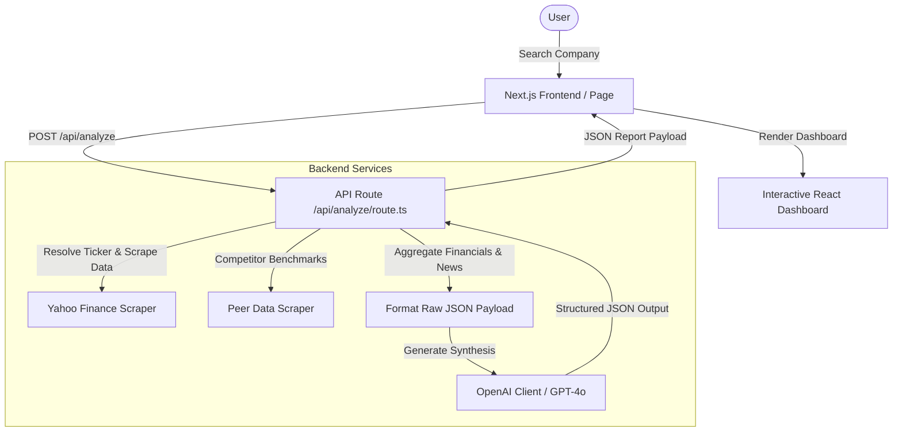

# AI Investment Research Agent

An institutional-grade, production-ready **AI Investment Research Agent** built using Next.js (App Router), React, TypeScript, Tailwind CSS, and Recharts. This agent conducts real-time fundamental research, competitor benchmarking, stock price history charting, news sentiment analysis, SWOT profiling, and multi-dimensional risk scoring to output an overall investment rating and recommendation.

---

## 🚀 Key Features

- **Company Search Engine**: Accepts standard company names (e.g. "Apple", "Nvidia") and resolves them to their correct ticker symbols (`AAPL`, `NVDA`) globally, including Indian stock markets (e.g. `RELIANCE.NS`, `TATAMOTORS.NS`).
- **Real-Time Financial Scraper**: Directly fetches balance sheets, income statements, profitability margins, and cash flows using `yahoo-finance2`. No manual entry or placeholder data.
- **Interactive Price Charting**: Renders historical prices (1-year, 3-year, and 5-year ranges) with an interactive Area Chart complete with glassmorphic tooltip hovering and 52-week price range indicators.
- **Competitor Benchmarking**: Automatically discovers sector peers and compiles a comparative matrix of Revenue, Market Cap, Trailing P/E, Margins, and Growth with visual charts.
- **News Sentiment Screening**: Scrapes the latest market news headlines and classifies their tone (Positive, Neutral, Negative) to construct an aggregate Media Sentiment Index.
- **SWOT & Risk Profiling**: Performs qualitative SWOT reviews and evaluates 6 key risk areas (Financial, Business, Regulatory, Competition, Market, Tech) on a 0-10 scale.
- **Dynamic Decision Scorecard**: Synthesizes all data points to generate an overall **Investment Score (0-100)** and recommendation (`Strong Buy`, `Buy`, `Hold`, `Avoid`, `Pass`) with a detailed thesis.
- **Analyst Tools**:
  - **PDF Report Export**: Print-ready CSS overrides instantly format the dashboard into a formal corporate research report.
  - **Copy Markdown**: Copies the entire structured report in raw Markdown to the clipboard.
  - **JSON Download**: Allows downloading the complete parsed financial and AI dataset.
  - **Search History**: Caches and displays the 10 most recent reports locally for instant comparison.
- **Premium UX**: Premium dark-mode UI styled with glassmorphism panels, glowing borders, custom scrollbars, multi-step progress stepper animation, and confetti celebrate indicators for Strong Buy ratings.

---

## 🛠️ Tech Stack

- **Frontend**: Next.js 15 (App Router), React 19, TypeScript, Tailwind CSS v4, Lucide React (Icons), Recharts (Charts), Canvas Confetti.
- **Backend**: Next.js API Routes (Node.js environment).
- **AI Engine**: OpenAI API (GPT-4o) with structured JSON outputs.
- **Financial Source**: Yahoo Finance API (via `yahoo-finance2`).

---

## 🏗️ Project Architecture



### Folder Structure

```
app/
│
├── api/
│   └── analyze/
│       └── route.ts         # Main research backend endpoint
│
├── components/
│   ├── OverviewSection.tsx   # CEO, employee counts, founding facts
│   ├── FinancialsSection.tsx # Profitability margins, cash flows, solvency
│   ├── StockPerformance.tsx  # Price AreaChart, 52-wk slider, returns
│   ├── CompetitorsSection.tsx # Peer benchmaking tables & comparison bars
│   ├── NewsAnalysis.tsx      # News feed, article tags, sentiment pie
│   ├── SwotAnalysis.tsx      # Strengths, Weaknesses, Opportunities, Threats
│   ├── RiskAnalysis.tsx      # Risk dimension radar chart & details
│   └── RecommendationSection.tsx # Gauge score, final decision, thesis
│
├── types/
│   └── index.ts             # TypeScript definitions
│
├── utils/
│   └── format.ts            # Currency, percent, and large magnitude formatting
│
└── globals.css              # Custom scrollbars, glassmorphism CSS
```

---

## 🤖 AI Workflow (9-Step Pipeline)

Once the user clicks **Analyze Company**, the backend API route executes the following sequence:

1. **Ticker Resolution**: Checks the input term against Yahoo Finance's search index. If a company name is entered, it automatically maps it to the primary Equity Symbol.
2. **Financial Scraping**: Queries the `assetProfile`, `price`, `summaryDetail`, `financialData`, and `defaultKeyStatistics` modules.
3. **Historical Analysis**: Fetches 5-year monthly pricing histories and calculates percentage returns (1-month, 6-month, 1-year, 5-year).
4. **Competitor Discovery**: Identifies peer companies by checking an internal benchmark map or looking up related symbols in the same industry sector, then scraping their metrics.
5. **News Feed Gathering**: Scrapes recent publisher news articles related to the ticker.
6. **AI News Sentiment Analysis**: Evaluates each article to determine its sentiment and calculates an aggregate score.
7. **SWOT Generation**: Evaluates internal/external factors based on the scraped metrics.
8. **Risk Dimension Scoring**: Allocates threat coefficients (0-10) for Financial, Business, Regulatory, Competition, Market, and Technology risks.
9. **Final Recommendation**: Summarizes the findings to output a rating, thesis, key advantages, risks, and a confidence percentage.

---

## 🔌 API Documentation

### POST `/api/analyze`

Resolves a query and conducts full financial benchmarking + AI synthesis.

**Request Body**:
```json
{
  "companyName": "Apple"
}
```

**Response Schema (Truncated JSON)**:
```json
{
  "overview": {
    "name": "Apple Inc.",
    "ticker": "AAPL",
    "industry": "Consumer Electronics",
    "sector": "Technology",
    "headquarters": "Cupertino, CA, United States",
    "ceo": "Timothy Donald Cook",
    "founded": 1976,
    "employees": 164000,
    "marketCap": 3450000000000,
    "description": "..."
  },
  "financialAnalysis": {
    "revenue": 385600000000,
    "netIncome": 100400000000,
    "eps": 6.57,
    "peRatio": 32.5,
    "debt": 105000000000,
    "freeCashFlow": 108000000000,
    "grossMargin": 0.46,
    "operatingMargin": 0.31,
    "profitMargin": 0.26,
    "roe": 1.45,
    "roa": 0.29,
    "revenueGrowth": 0.05,
    "earningsGrowth": 0.12
  },
  "stockPerf": {
    "currentPrice": 215.3,
    "fiftyTwoWeekHigh": 220.5,
    "fiftyTwoWeekLow": 165.2,
    "oneMonthReturn": 5.4,
    "sixMonthReturn": 12.3,
    "oneYearReturn": 24.1,
    "fiveYearReturn": 312.5
  },
  "history": [
    { "date": "2021-06", "close": 136.96 }
  ],
  "newsArticles": [
    {
      "headline": "...",
      "source": "Yahoo Finance",
      "date": "2026-06-28",
      "summary": "...",
      "sentiment": "Positive"
    }
  ],
  "competitorData": [
    {
      "ticker": "MSFT",
      "name": "Microsoft Corporation",
      "marketCap": 3200000000000,
      "revenue": 245000000000,
      "peRatio": 35.2,
      "profitMargin": 0.36,
      "growth": 0.14
    }
  ],
  "aiAnalysis": {
    "newsSentiment": {
      "overall": "Positive",
      "articles": [
        { "headline": "...", "sentiment": "Positive" }
      ]
    },
    "swot": {
      "strengths": ["Strong brand loyalty"],
      "weaknesses": ["Valuation premium"],
      "opportunities": ["Generative AI integration"],
      "threats": ["Regulatory anti-trust pressures"]
    },
    "risks": {
      "financialRisk": { "score": 3, "reason": "..." }
    },
    "competitorAnalysisSummary": "...",
    "investmentScore": 85,
    "recommendation": "Strong Buy",
    "recommendationDetails": {
      "investmentThesis": "...",
      "keyAdvantages": ["Scale"],
      "majorRisks": ["Regulation"],
      "supportingEvidence": "...",
      "confidenceScore": 88
    },
    "aiReasoning": "..."
  }
}
```

---

## ⚙️ Setup and Installation

### 1. Configure Environment Variables
Create a `.env.local` file in the root directory:
```bash
cp .env.example .env.local
```
Add your credentials:
```env
OPENAI_API_KEY=your_openai_api_key
```

*Note*: If `OPENAI_API_KEY` is omitted, the app will dynamically run in **Showcase/Demo Mode**—utilizing real financial figures fetched live from Yahoo Finance, while employing a rule-based AI engine to generate detailed SWOT, sentiments, risk coefficients, and thesis recommendations. This allows the app to be fully tested out of the box without requiring API keys!

### 2. Install Packages
```bash
npm install
```

### 3. Run Development Server
```bash
npm run dev
```
Open [http://localhost:3000](http://localhost:3000) in your browser.

### 4. Create Production Build
```bash
npm run build
npm run start
```

---

## ☁️ Deployment

Deploy the application to **Vercel** with a single click:

1. Push your repository to GitHub.
2. Link the repository to your Vercel Dashboard.
3. Configure the `OPENAI_API_KEY` environment variable in the Project Settings on Vercel.
4. Click **Deploy**.
# Inside-IIm

